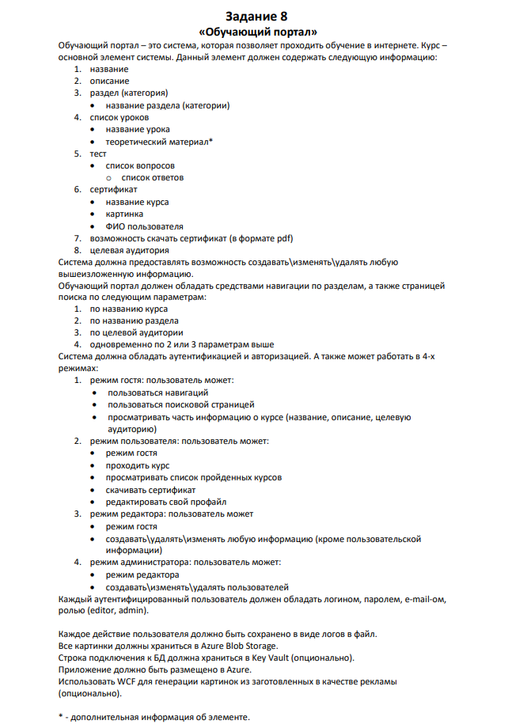

# "Training Portal" Web application

["Training Portal"🔽](#task-description) is a system that allows you to study online.

***

## Project status

***

## Roadmap

- [X] Project architecture
- [X] Models
- [ ] Services
  - [ ] Section navigation
  - [ ] Сourse search page by parameters
  - [ ] Viewing course information
  - [ ] Passing the course
  - [ ] View the list of completed courses
  - [ ] Downloading the certificate
  - [X] Editing a profile
  - [ ] Site information management
  - [X] User management
- [ ] Views
- [X] Working with DB
- [X] Authentication / Authorization by cookies
- [X] Logging

- [ ] NUnit and unit-tests
- [ ] Deploy in Azure

##
- [ ] Extra functionality:
  - [ ] Connect DB string in Key Vault
  - [ ] WCF image generation

- [ ] Documentation

##

[🔼](#training-portal-web-application)

***

## Task description ##

##

[🔼](#training-portal-web-application)

***
